<div align="center">

# 🎰 Onchain Roulette Game

[](https://soliditylang.org/)
[](https://getfoundry.sh/)
[](LICENSE)
<br>
[](https://ethereum.org)
[]()

<p align="center">
  <strong>A fully decentralized Roulette game built with Solidity and Foundry</strong>
</p>

<p align="center">
  <a href="#-features">Features</a> •
  <a href="#-architecture">Architecture</a> •
  <a href="#-smart-contracts">Smart Contracts</a> •
  <a href="#-getting-started">Getting Started</a> •
  <a href="#-usage">Usage</a>
</p>


</div>

---

## ✨ Features

<table>
<tr>
<td>

### 🎲 Fair Gameplay
- Completely decentralized logic
- On-chain randomness using `prevrandao`
- Verifiable game history and results
- Transparent round management

</td>
<td>

### 💰 Automated Rewards
- Automatic payout to winner (70% of pool)
- Automatic refunds if no winner is found
- 30% House fee for sustainable operation
- Instant withdrawals for winnings

</td>
</tr>
<tr>
<td>

### 🛡️ Secure Design
- Checks-effects-interactions pattern
- Owner-restricted administrative functions
- Robust input validation and error handling
- Protection against re-participation

</td>
<td>

### ⚡ Gas Optimized
- Efficient storage packing
- Optimized loops and mapping usage
- Built with latest Solidity 0.8.30
- Minimal call data overhead

</td>
</tr>
</table>

---

## 🏗️ Architecture

```mermaid
graph TB
    subgraph "Roulette Platform"
        A["🎛️ Rouletee Contract"] --> B["📝 Round Storage"]
        A --> C["🎲 Randomness"]
        A --> D["💰 Treasury"]
    end
    
    subgraph "User Actions"
        E["👤 Player"] -->|"Participate (0.01 ETH)"| A
        E -->|"Pick Number (1-33)"| A
    end

    subgraph "Admin Actions"
        F["🔑 Owner"] -->|"Spin Wheel"| A
        F -->|"Reset Round"| A
        F -->|"Withdraw Fees"| D
    end
    
    subgraph "Game Flow"
        B -->|"Check Active"| A
        C -->|"Generate Result"| A
        A -->|"Distribute Winnings"| E
        A -->|"Refund (if no winner)"| E
    end
    
    style A fill:#e1f5ff,stroke:#1976d2,stroke-width:3px
    style B fill:#fff3e0,stroke:#f57c00,stroke-width:3px
    style E fill:#e8f5e9,stroke:#388e3c,stroke-width:2px
    style F fill:#f3e5f5,stroke:#7b1fa2,stroke-width:2px
```



---

## 📜 Smart Contracts

### 🎛️ Rouletee.sol
The core game contract that manages the betting players, rounds, and payouts.

| Function | Description | Access |
|----------|-------------|--------|
| `participate(uint256)` | Enter the round with a chosen number | Public + Payable |
| `spin()` | Generate random number & distribute rewards | Owner Only |
| `resetRound()` | Activate the next game round | Owner Only |
| `withdraw()` | Collect accumulated house fees | Owner Only |
| `getPlayers(roundId)` | View participants for a round | Public View |
| `getResult(roundId)` | View winning number for a round | Public View |

**Key Constants:**
- 🎟️ **Entry Fee**: `0.01 ETH`
- 🔢 **Number Range**: `1 - 33`
- 👥 **Players**: `Min 2 / Max 5`
- 🏠 **House Cut**: `30%`

---

## 🚀 Getting Started

### Prerequisites

```bash
# Install Foundry
curl -L https://foundry.paradigm.xyz | bash
foundryup

# Verify installation
forge --version
```

### Installation

```bash
# Clone the repository
git clone https://github.com/zaifmirza/Roulette_Game.git
cd Roulette_Game

# Install dependencies
forge install

# Build contracts
forge build
```

---

## 📖 Usage

### Build

```bash
forge build
```

### Test

```bash
# Run all tests
forge test

# Run with verbosity
forge test -vvv
```

### Deploy

```bash
# Deploy to local Anvil
forge script script/Deploy.sol --rpc-url http://127.0.0.1:8545 --broadcast

# Deploy to Testnet (example)
forge script script/Deploy.sol --rpc-url $RPC_URL --private-key $PRIVATE_KEY --broadcast
```

---

## 📊 High-Level Data Structures

### Round Struct

```solidity
struct Round {
    bool isActive;                  // Is betting open?
    bool isFinished;                // Has the wheel appeared?
    Players[] players;              // List of participants
    uint256 result_no;              // Winning number (0 if not spun)
    mapping(address => bool) hasParticipated; // Anti-spam check
}
```

### Players Struct

```solidity
struct Players {
    address player;        // Participant wallet address
    uint256 numberPicked;  // The number they bet on
}
```

### Error Handling

| Error Message | Condition |
|-------|-----------|
| `"Incorrect entry fee"` | precise 0.01 ETH not sent |
| `"Number out of range"` | Pick outside 1-33 |
| `"Round is not active"` | Betting closed or finished |
| `"Already participated"` | Double entry attempt |
| `"Round is full"` | Max 5 players reached |
| `"Not enough players to spin"` | Min 2 players required |

---

## 🛠️ Tech Stack

<p align="center">
  
  
  
</p>

---

## 📈 Future Roadmap

- [ ] 🔗 Chainlink VRF integration for true randomness
- [ ] 🪙 ERC20 Token betting support
- [ ] 🎨 Frontend DApp integration
- [ ] 🏆 Leaderboard and player stats
- [ ] 🗳️ Governance for parameter adjustments

---

## � License

This project is licensed under the MIT License - see the [LICENSE](LICENSE) file for details.

---

<div align="center">

### Made with ❤️ by Zaif

<p align="center">
  <a href="https://github.com/zaifmirza">
    
  </a>
</p>


</div>
